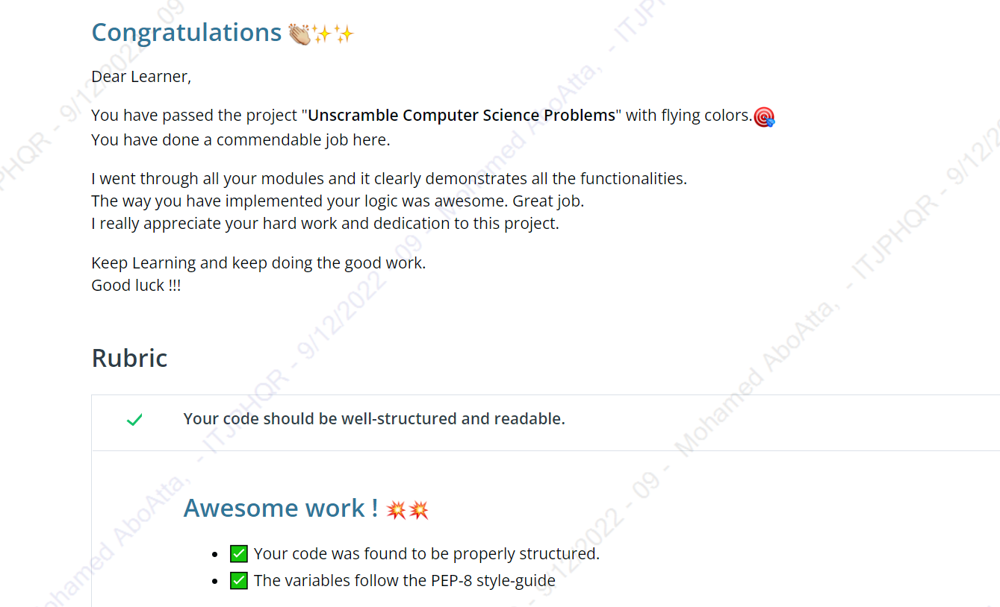

# Investigating Texts and Calls

## Project Overview
In this project, I have completed five tasks based on a fabricated set of calls and texts exchanged during September 2016. I used Python to analyze and answer questions about the texts and calls contained in the dataset. Lastly, I performed run time analysis of my solution and determined its efficiency.

## What did I learn?
- Apply my Python knowledge to breakdown problems into their inputs and outputs.
- Perform an efficiency analysis of my solution.

# About the data
The text and call data are provided in csv files.

The text data (text.csv) has the following columns: sending telephone number (string), receiving telephone number (string), timestamp of text message (string).

The call data (call.csv) has the following columns: calling telephone number (string), receiving telephone number (string), start timestamp of telephone call (string), duration of telephone call in seconds (string)

All telephone numbers are 10 or 11 numerical digits long. Each telephone number starts with a code indicating the location and/or type of the telephone number. There are three different kinds of telephone numbers, each with a different format:

- Fixed lines start with an area code enclosed in brackets. The area codes vary in length but always begin with 0. Example: "(022)40840621".
- Mobile numbers have no parentheses, but have a space in the middle of the number to help readability. The mobile code of a mobile number is its first four digits and they always start with 7, 8 or 9. Example: "93412 66159".
- Telemarketers' numbers have no parentheses or space, but start with the code 140. Example: "1402316533".

## Calculating Big O
After I have completed my solution for each problem, I performed a run time analysis (Worst Case Big-O Notation) of my solution. The time complexity analysis are documented for each problem in the Analysis.txt file.

## Certification

This project was a milestone in my journey to study the Data Structures & Algorithms Nanodegree Program provided by Udacity.

> I am currently studying this nanodegree and will share the certificate once I graduate.

## What Software Did I Need?

To complete this project, I used the following software:

* Python
* A Python IDE: Pycharm

## About The Author

* Author: Mohamed Abdel-Gawad Ibrahim
* Contact: muhammadabdelgawwad@gmail.com
* Phone: +201069052620 || +201147821232
